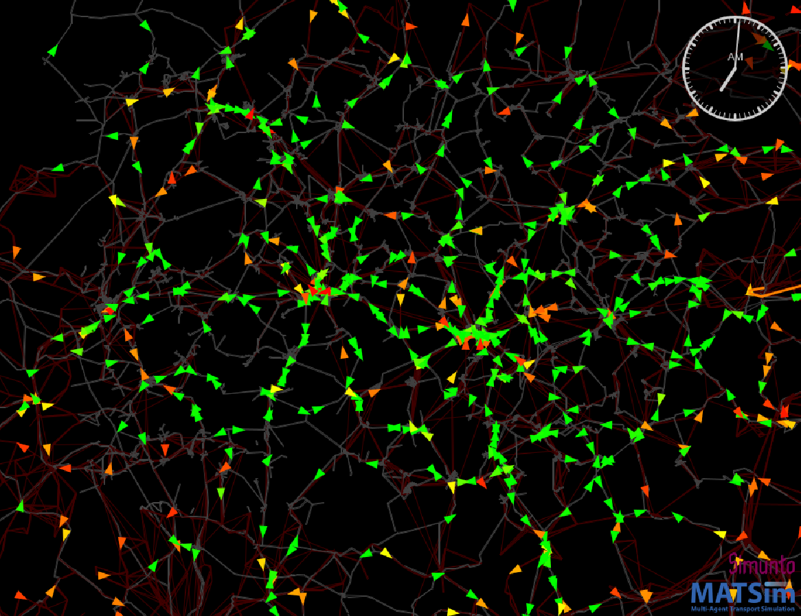

# The MATSim Open Vulkaneifel Scenario




This is the MATSim model for the area of Vulkaneifel.

This repository contains the version 1.1 of the Open Vulkaneifel scenario.
The main changes are:

* The transit schedule contains now a larger network of regional bus lines.
* Freight agents and short trips were added to the population.

<a rel="TU Berlin" href="https://www.vsp.tu-berlin.de"></a>

This scenario contains a 25pct sample of the Vulkaneifel and its surrounding area; road capacities are accordingly reduced. 

### Project structure

Please note the project structure is as follows:
* `src` for sources
* `input` for input data, this replaces `scenario` from older projects.

## Licenses

The **MATSim program code** in this repository is distributed under the terms of the [GNU General Public License as published by the Free Software Foundation (version 2)](https://www.gnu.org/licenses/old-licenses/gpl-2.0.en.html). The MATSim program code are files that reside in the `src` directory hierarchy and typically end with `*.java`.

The **MATSim input files, output files, analysis data and visualizations** are licensed under a <a rel="license" href="http://creativecommons.org/licenses/by/4.0/">Creative Commons Attribution 4.0 International License</a>.
<a rel="license" href="http://creativecommons.org/licenses/by/4.0/"></a><br /> MATSim input files are those that are used as input to run MATSim. They often, but not always, have a header pointing to matsim.org. They typically reside in the `scenarios` directory hierarchy. MATSim output files, analysis data, and visualizations are files generated by MATSim runs, or by postprocessing.  They typically reside in a directory hierarchy starting with `output`.

**Other data files**, in particular in `input`, have their own individual licenses that need to be individually clarified with the copyright holders.

### Note

Handling of large files within git is not without problems (git lfs files are not included in the zip download; we have to pay; ...).  In consequence, large files, both on the input and on the output side, reside at https://svn.vsp.tu-berlin.de/repos/public-svn/matsim/scenarios/countries/de/vulkaneifel .

### Java Version

The project uses Java 17. Usually a suitable SDK is packaged within IntelliJ or Eclipse. Otherwise, one must install a 
suitable sdk manually, which is available [here](https://openjdk.java.net/)

### Building and Running it locally

You can build an executable jar-file by executing the following command:

```sh
./mvnw clean package
```

or on Windows:

```sh
mvnw.cmd clean package
```

This will download all necessary dependencies (it might take a while the first time it is run) and create a file `matsim-vulkaneifel-1.1-SNAPSHOT.jar` in the top directory. This jar-file can either be double-clicked to start the MATSim GUI, or executed with Java on the command line:

```sh
java -jar matsim-vulkaneifel-1.1-SNAPSHOT.jar
```
